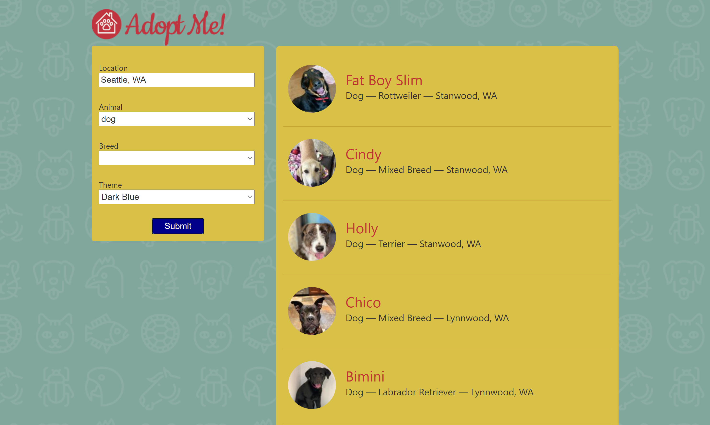

# Adopt Pets App
A React app for adopting pets! 

This was one of my first React apps from early 2019, based on the lessons Intro to React by Brian Holt on frontendmasters.com.
Featuring: breed search, three types of pets (cats, dogs, barnyard), location, and a theme setting.

After you clone the repository, don't forget to:

- ` npm upgrade `
- ` npm install ` 
- ` npm update `
- ` npm audit fix `
- Check [Brian Holt's repo](https://github.com/btholt/complete-intro-to-react-v5) for any additional debugging tips that may arise!

Example:

